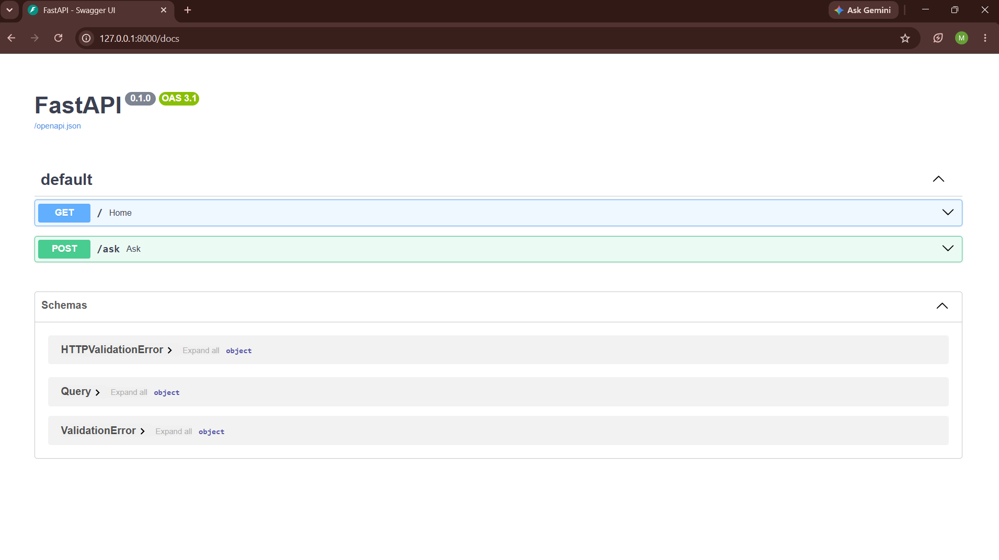
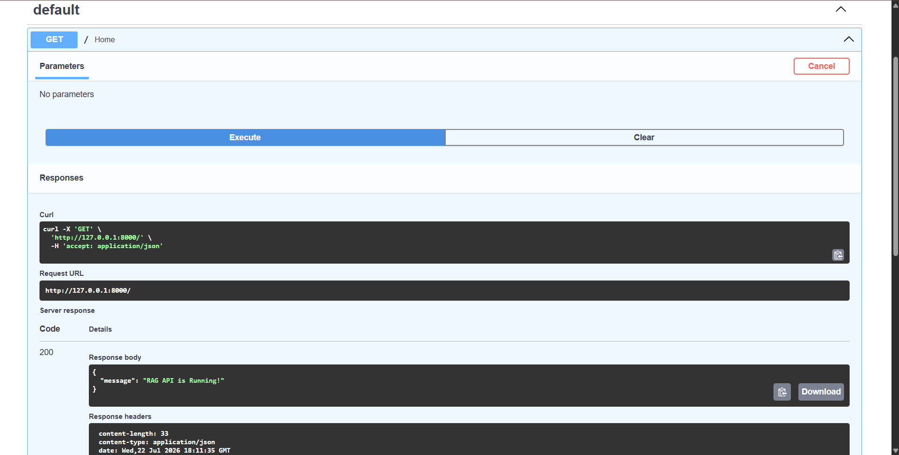
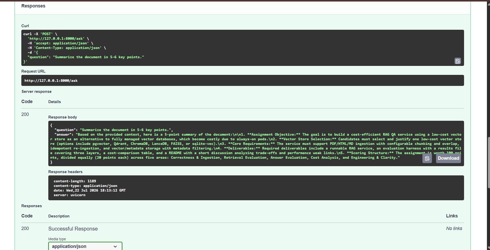
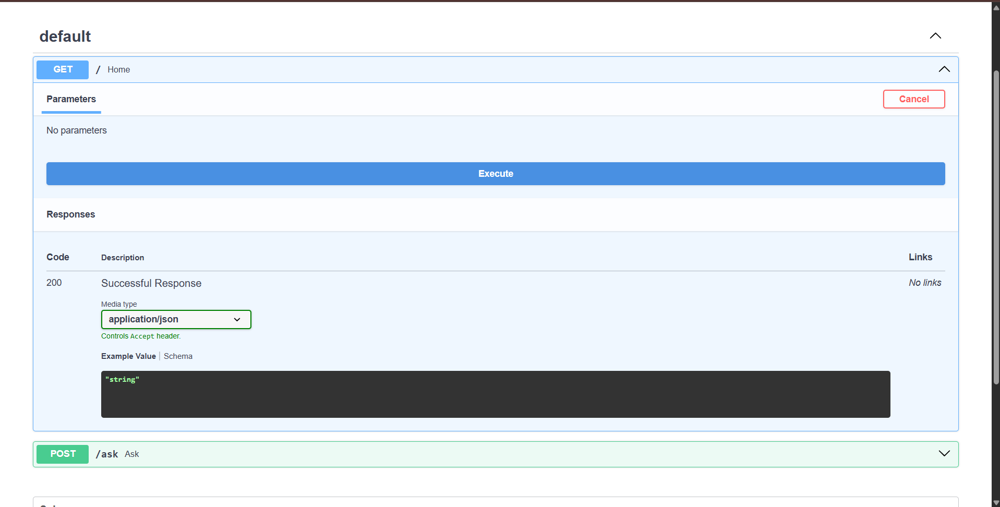

# 📄 FastAPI RAG - Document Question Answering API

A Retrieval-Augmented Generation (RAG) application that allows users to ask questions about a PDF document. The system retrieves the most relevant context using ChromaDB and generates accurate answers using Google Gemini.

---

## 🚀 Features

- Upload and process PDF documents
- Split documents into semantic chunks
- Generate embeddings using Google Gemini
- Store embeddings in ChromaDB
- Retrieve relevant context using similarity search
- Generate answers using Gemini Flash
- REST API built with FastAPI
- Interactive API documentation using Swagger UI

---

## 🛠️ Tech Stack

- Python
- FastAPI
- LangChain
- ChromaDB
- Google Gemini
- Pydantic
- Uvicorn

---

## 📂 Project Structure

```
fastapi-rag/
│
├── app/
│   ├── main.py
│   ├── loader.py
│   ├── chunker.py
│   ├── embedding.py
│   ├── vectordb.py
│   ├── retriever.py
│   ├── rag.py
│   └── check_models.py
│
├── data/
│   └── docs/
│
├── .env.example
├── requirements.txt
└── README.md
```

---

## ⚙️ Installation

### Clone the repository

```bash
git clone https://github.com/monishach2806/fastapi-rag.git
```

```bash
cd fastapi-rag
```

---

### Create Virtual Environment

```bash
python -m venv .venv
```

Windows

```bash
.venv\Scripts\activate
```

Mac/Linux

```bash
source .venv/bin/activate
```

---

### Install Dependencies

```bash
pip install -r requirements.txt
```

---

### Configure Environment Variables

Create a `.env` file.

```env
GOOGLE_API_KEY=your_api_key_here
```

---

### Run the API

```bash
uvicorn app.main:app --reload
```

Server runs at:

```
http://127.0.0.1:8000
```

Swagger UI:

```
http://127.0.0.1:8000/docs
```

---

## 📌 API Endpoint

### Ask Questions

**POST**

```
/ask
```

Example Request

```json
{
  "question": "What is Retrieval Augmented Generation?"
}
```

Example Response

```json
{
  "answer": "Retrieval-Augmented Generation (RAG) combines document retrieval with a large language model to generate context-aware answers."
}
```

---

## 🔄 RAG Workflow

1. Load PDF document
2. Split document into chunks
3. Generate embeddings
4. Store embeddings in ChromaDB
5. Retrieve relevant chunks
6. Build prompt with retrieved context
7. Generate answer using Google Gemini

---

## 📸 Demo

### Swagger UI



---

### API Response



---

### Document Summary



---

### Project Structure



## 📈 Future Improvements

- Multi-document support
- File upload endpoint
- Chat history
- Hybrid search
- Docker support
- Authentication

---

## 👩‍💻 Author

**Monisha**

GitHub: https://github.com/monishach2806
